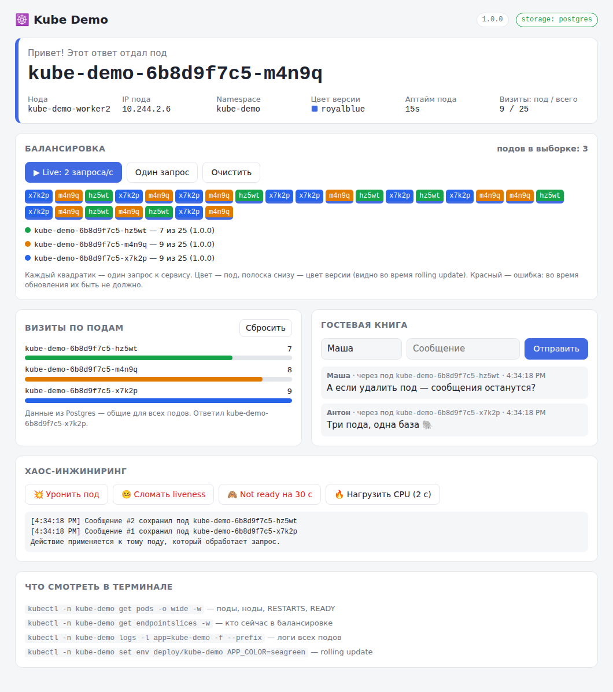
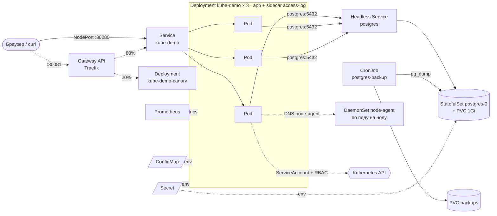
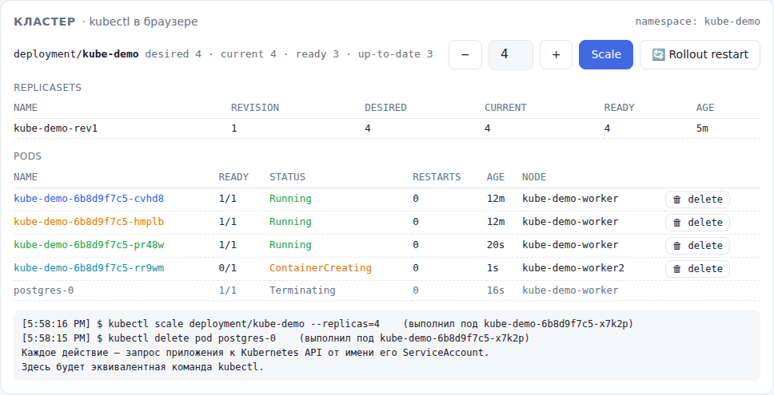
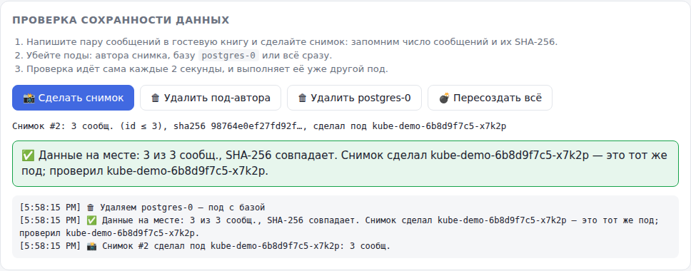

# ☸️ Kube Demo

Маленькое приложение на Go для живой демонстрации Kubernetes. Каждый ответ говорит,
**какой под его отдал** (и на какой ноде он живёт), а вокруг этого несколько штук,
на которых удобно показывать, как работает кубер:

- **счётчик визитов по подам**: видно, как Service раскидывает запросы;
- **гостевая книга** в Postgres (StatefulSet + PVC): данные общие для всех реплик и переживают рестарты;
- **kubectl в браузере**: `get pods/rs/deploy`, `scale`, `delete pod`, `rollout restart` прямо из UI:
  приложение само ходит в Kubernetes API от имени своего ServiceAccount (права — RBAC);
- **проверка сохранности данных**: снимок гостевой книги (число сообщений + SHA-256), потом убиваем
  поды и даже базу, и уже другой под доказывает, что ничего не потерялось;
- **хаос-кнопки**: уронить под, сломать liveness, вывести из балансировки, съесть память (OOMKilled), нагрузить CPU;
- **сломанный релиз**: rollout застревает по `progressDeadlineSeconds`, сервис продолжает работать, `rollout undo` из UI;
- **и ещё**: CronJob-бэкапы базы, нативный sidecar, DaemonSet на каждой ноде, in-place resize,
  NetworkPolicy, ResourceQuota, метрики + Prometheus, Gateway API с canary 80/20;
- **graceful shutdown**: rolling update проходит без единой ошибки у клиентов;
- `curl` получает одну строку текста, браузер получает UI.



```
$ curl localhost:30080
Привет от kube-demo-6b8d9f7c5-x7k2p | node: kube-demo-worker | 1.0.0 | визиты: 12 этим подом / 37 всего (postgres)
$ curl localhost:30080
Привет от kube-demo-6b8d9f7c5-m4n9q | node: kube-demo-worker2 | 1.0.0 | визиты: 13 этим подом / 38 всего (postgres)
```

Образ весит ~8 МБ, под ест меньше 10 МБ памяти. Из зависимостей только stdlib и драйвер `pgx`:
метрики Prometheus и клиент Kubernetes API написаны руками. Каждая фича проверяется e2e в CI
на настоящем kind-кластере.

## Что внутри



```
.
├── app/                     # Go-приложение
│   ├── main.go              # запуск, graceful shutdown
│   ├── server.go            # HTTP API, пробы, хаос
│   ├── store*.go            # хранилище: memory | postgres, снимки данных
│   ├── k8s*.go              # клиент Kubernetes API и «kubectl в браузере»
│   ├── metrics.go           # /metrics в формате Prometheus
│   ├── agent.go             # режим агента для DaemonSet (`kube-demo agent`)
│   ├── web/index.html       # UI (вшит в бинарник через go:embed)
│   └── Dockerfile
├── k8s/
│   ├── kustomization.yaml   # kubectl apply -k k8s/
│   ├── namespace.yaml
│   ├── app/                 # ConfigMap, Deployment (+ sidecar), Service (NodePort), RBAC
│   ├── postgres/            # Secret, headless Service, StatefulSet, CronJob бэкапа
│   ├── node-agent/          # DaemonSet + headless Service
│   └── extras/              # по желанию: HPA, PDB, квоты, NetworkPolicy,
│       ├── observability/   #   Prometheus
│       └── gateway/         #   Gateway API (Traefik), canary, Ingress
├── scripts/                 # smoke, zero-downtime, сохранность данных, e2e всех фич
├── kind-config.yaml         # локальный кластер: 1 control-plane + 2 worker
├── docker-compose.yml       # запуск без Kubernetes
└── Makefile                 # make help
```

## Быстрый старт (kind)

Нужны `docker`, [`kind`](https://kind.sigs.k8s.io/docs/user/quick-start/#installation), `kubectl`, `make`.

```bash
make up          # kind-кластер + сборка образа + загрузка в kind + деплой
open http://localhost:30080
```

То же самое руками:

```bash
kind create cluster --config kind-config.yaml
docker build -t kube-demo:1.0.0 app
kind load docker-image kube-demo:1.0.0 --name kube-demo   # реестр не нужен
kubectl apply -k k8s/
kubectl -n kube-demo get pods -o wide -w
```

<details>
<summary><b>Другие кластеры: Docker Desktop, minikube, k3d, удалённый</b></summary>

| Кластер | Как доставить образ | Адрес |
|---|---|---|
| **Docker Desktop** | `docker build -t kube-demo:1.0.0 app` (в режиме kubeadm кубер видит локальные образы) | http://localhost:30080 |
| **minikube** | `minikube image build -t kube-demo:1.0.0 app` | `minikube service -n kube-demo kube-demo --url` |
| **k3d** | `k3d image import kube-demo:1.0.0` (кластер создавать с `-p "30080:30080@server:0"`) | http://localhost:30080 |
| **Удалённый** | образ из GHCR (см. [CI](#ci)), поменять `images` в `k8s/kustomization.yaml` | `http://<IP любой ноды>:30080` |

</details>

## Сценарии для демо

Удобно держать открытыми три окна: браузер с UI (нажать **▶ Live**) и два терминала:

```bash
kubectl -n kube-demo get pods -o wide -w     # терминал 1: что происходит с подами
make watch                                   # терминал 2: бесконечный curl
```

### 1. Балансировка: кто ответил?

```bash
for i in $(seq 10); do curl -s localhost:30080; done
kubectl -n kube-demo get endpointslices      # IP подов за сервисом
```

В UI каждый квадратик означает один запрос, цвет показывает под, который ответил.

> **Подвох 1.** `kubectl port-forward svc/kube-demo 8080:80` цепляется к **одному** поду,
> и балансировки не будет. Смотрите через NodePort (или Ingress).
>
> **Подвох 2.** kube-proxy балансирует **соединения**, а не запросы. Браузер держит keep-alive,
> поэтому приложение отдаёт `Connection: close`, иначе все запросы со страницы шли бы в один под.

### 2. Масштабирование

```bash
kubectl -n kube-demo scale deployment/kube-demo --replicas=6
kubectl -n kube-demo scale deployment/kube-demo --replicas=2
```

То же самое — кнопками `−` / `+` и **Scale** в блоке «Кластер» (см. п. 8).
Новые поды появляются в ленте UI через пару секунд, когда пройдут readiness-пробу.
Благодаря `topologySpreadConstraints` они раскладываются по разным нодам (колонка `NODE`).

### 3. Self-healing

```bash
kubectl -n kube-demo delete pod <имя-пода>             # Deployment тут же создаст замену
curl -X POST localhost:30080/api/chaos/crash           # или кнопка «💥 Уронить под»
kubectl -n kube-demo logs <имя-пода> --previous        # логи упавшего контейнера
```

После `crash` у пода растёт `RESTARTS`, а имя остаётся прежним: kubelet перезапустил
контейнер, а не пересоздал под. Если ронять под часто, получится `CrashLoopBackOff`
с экспоненциальной задержкой.

### 4. Liveness и readiness

| Кнопка | Что ломается | Что делает Kubernetes |
|---|---|---|
| 🤒 Сломать liveness | `/healthz` → 500 | через 3 провала (~15 с) **перезапускает** контейнер |
| 🙈 Not ready на 30 с | `/readyz` → 503 | **убирает под из балансировки** (`READY 0/1`), не перезапуская его; через 30 с возвращает |

```bash
curl -X POST 'localhost:30080/api/chaos/unready?seconds=30'
kubectl -n kube-demo get endpointslices -w
kubectl -n kube-demo describe pod <имя-пода>    # в Events видно, какая проба упала
```

> Readiness **намеренно не проверяет базу**: если Postgres ляжет, все поды разом стали бы
> not ready, и сервис отдавал бы пустоту вместо понятной ошибки. Liveness тоже не смотрит
> на зависимости, иначе падение БД перезапустило бы все поды.

### 5. Rolling update и откат

```bash
kubectl -n kube-demo set env deployment/kube-demo APP_COLOR=seagreen GREETING=Hola
kubectl -n kube-demo rollout status deployment/kube-demo
kubectl -n kube-demo rollout history deployment/kube-demo
kubectl -n kube-demo rollout undo deployment/kube-demo
```

В UI полоска под квадратиками (цвет версии) постепенно меняется с синей на зелёную.
**Красных квадратиков (ошибок) быть не должно**, это проверяет `make zero-downtime`.
Обеспечивают это три вещи:

1. `maxUnavailable: 0, maxSurge: 1`: старый под гасится только после того, как новый стал Ready;
2. readiness-проба: трафик на новый под идёт только после того, как он действительно готов;
3. graceful shutdown: по SIGTERM приложение сначала переводит `/readyz` в 503, ждёт
   `SHUTDOWN_DELAY` (5 с), пока kube-proxy уберёт под из балансировки, дорабатывает начатые
   запросы и только потом выходит. Посмотреть на это можно в `make logs`: там будет `SIGTERM received, draining`.

> Эксперимент: `kubectl -n kube-demo set env deployment/kube-demo SHUTDOWN_DELAY=0s`, после чего
> ещё раз прогнать `make zero-downtime`. Под нагрузкой могут начать проскакивать ошибки:
> под уже закрыл порт, а kube-proxy на какой-то ноде ещё не успел убрать его из правил.

Обновить можно и через новый образ: `make v2` собирает `kube-demo:2.0.0` и делает `kubectl set image`.

### 6. ConfigMap и Secret

```bash
kubectl -n kube-demo edit configmap kube-demo              # поменять GREETING
curl localhost:30080                                        # ...ничего не изменилось!
kubectl -n kube-demo rollout restart deployment/kube-demo   # env читается только при старте
```

```bash
kubectl -n kube-demo get secret postgres -o jsonpath='{.data.POSTGRES_PASSWORD}' | base64 -d
```

Secret хранится в base64, а base64 не шифрование. Для настоящих секретов нужны
Sealed Secrets, External Secrets, Vault и т.п.

### 7. Состояние: память пода или база

```bash
kubectl -n kube-demo set env deployment/kube-demo STORAGE=memory
```

Бейдж в UI становится оранжевым `storage: memory`. Теперь у каждого пода свой счётчик и
своя гостевая книга, и при каждом обновлении страницы «правда» другая. После рестарта пода
его данные пропадают. Это наглядное объяснение того, почему приложения в кубере должны быть
stateless. Вернуть базу: `kubectl -n kube-demo set env deployment/kube-demo STORAGE-`.

А теперь убиваем саму базу:

```bash
kubectl -n kube-demo delete pod postgres-0
kubectl -n kube-demo get pods,pvc -w
```

StatefulSet пересоздаст под **с тем же именем** `postgres-0` и подключит **тот же** PVC,
так что сообщения в гостевой книге останутся. Пока база поднимается, `/api/hello` отвечает
503 «хранилище недоступно», но поды приложения остаются Ready (см. п. 4), а пул
соединений `pgx` сам переподключается.

### 8. kubectl в браузере



Блок **«Кластер»** в UI показывает то же, что `kubectl get deploy,rs,pods`, и обновляется
раз в 2 секунды. Кнопки делают то же, что команды:

| В UI | Команда | Запрос к Kubernetes API |
|---|---|---|
| `−` / `+` и **Scale** | `kubectl scale deployment/kube-demo --replicas=N` | `PATCH deployments/kube-demo/scale` |
| **🔄 Rollout restart** | `kubectl rollout restart deployment/kube-demo` | `PATCH deployments/kube-demo` (аннотация `restartedAt`) |
| **🗑 delete** у пода | `kubectl delete pod <name>` | `DELETE pods/<name>` |

Эквивалентная команда появляется в логе под таблицей. На что посмотреть:

- при scale появляются поды `ContainerCreating` → `Running`, а при уменьшении — `Terminating`;
- при rollout restart создаётся новый ReplicaSet (revision +1), старый плавно уходит в 0;
- после удаления пода Deployment тут же создаёт замену с новым именем.

Приложение ходит в API **от своего ServiceAccount**, без client-go: токен и CA kubelet
монтирует в каждый под. Права описаны в [`k8s/app/rbac.yaml`](k8s/app/rbac.yaml): только свой
namespace, `scale`/`patch` только для deployment `kube-demo`, удалять можно только поды демки.

```bash
kubectl -n kube-demo auth can-i --list --as=system:serviceaccount:kube-demo:kube-demo
kubectl -n kube-demo auth can-i delete deployments --as=system:serviceaccount:kube-demo:kube-demo   # no
```

> Это демо: любой, кто открыл страницу, может масштабировать и удалять поды. Не выставляйте её наружу.

### 9. Данные переживают смену подов



Блок **«Проверка сохранности данных»**:

1. напишите пару сообщений в гостевую книгу и нажмите **📸 Сделать снимок**: приложение сохранит
   в базу число сообщений и SHA-256 от их содержимого;
2. нажмите **🗑 Удалить под-автора**, **🗑 Удалить postgres-0** или **💣 Пересоздать всё**
   (rollout restart + удаление базы);
3. проверка запускается сама каждые 2 секунды: пока база поднимается, будет «⏳ ждём», потом
   «✅ Данные на месте: 5 из 5 сообщ., SHA-256 совпадает. Снимок сделал kube-demo-…-x7k2p — его
   уже нет в кластере; проверил kube-demo-…-m4n9q».

Для контраста переключитесь на `STORAGE=memory` (см. п. 7) и повторите: после удаления пода
будет «❌ снимок не найден: данные потеряны».

То же самое автоматически, в настоящем кластере (этот тест гоняется в CI):

```bash
make persistence
```

### 10. Внутри кластера: DNS, env, exec

```bash
kubectl -n kube-demo exec -it deploy/kube-demo -- sh
  env | sort                                # что пришло из ConfigMap, Secret и Downward API
  nslookup kube-demo                        # ClusterIP сервиса
  nslookup postgres                         # headless: сразу IP пода
  wget -qO- http://kube-demo/api/hello      # запрос через сервис изнутри
```

### 11. Автомасштабирование (HPA)

```bash
make metrics-server          # в kind его нет из коробки
make hpa-on                  # HPA (2..8 реплик, цель 50% CPU) + генератор нагрузки
kubectl -n kube-demo get hpa -w
kubectl -n kube-demo top pods
make hpa-off                 # через минуту-другую реплик станет меньше
```

Генератор нагрузки дёргает `/api/burn`, который честно жжёт CPU. Проценты в HPA
считаются **от `requests.cpu`** (50m), а не от лимита.

### 12. Обслуживание ноды: drain и PodDisruptionBudget

```bash
kubectl apply -f k8s/extras/pdb.yaml                        # не меньше 2 живых реплик
kubectl -n kube-demo get pod postgres-0 -o wide             # запомнить ноду с базой
kubectl drain kube-demo-worker2 --ignore-daemonsets --delete-emptydir-data
kubectl uncordon kube-demo-worker2
```

Поды приложения переезжают на другие ноды, а PDB не даёт выселить их все разом.
Для drain лучше выбрать ноду **без** `postgres-0`: в kind том `local-path` привязан к ноде,
и база не сможет переехать. Хороший повод поговорить о storage в кубере.

## Продвинутые сценарии

Всё ниже тоже проверяется в CI: `make features` (или одна фича: `make features F=oom`).

### 13. Сломанный релиз и rollout undo

Кнопка **💣 Выкатить сломанный релиз** в блоке «Кластер» меняет аннотацию в шаблоне пода.
Появляется новая ревизия, её поды через Downward API получают `RELEASE_STATE=broken-…` и
никогда не проходят readiness (`READY 1/2`: sidecar жив, приложение — нет).

- Благодаря `maxUnavailable: 0` старые поды не трогаются, **сервис продолжает работать**.
- Через `progressDeadlineSeconds: 60` Deployment получает `Progressing=False /
  ProgressDeadlineExceeded`, в UI загорается красный баннер. `kubectl rollout status` падает с ошибкой.
- Кубер **сам не откатывает**, это задача человека или CD. Кнопка **↩️ Rollout undo** делает то же,
  что `kubectl rollout undo`: берёт шаблон пода из ReplicaSet предыдущей ревизии и записывает его в Deployment.

```bash
kubectl -n kube-demo rollout status deployment/kube-demo      # error: ... exceeded its progress deadline
kubectl -n kube-demo rollout history deployment/kube-demo
kubectl -n kube-demo rollout undo deployment/kube-demo
```

### 14. Лимиты ресурсов и OOMKilled

В карточке пода видны **лимиты так, как их видит сам контейнер** (cgroup: `cpu.max`, `memory.max`).
Кнопка **🧨 OOM** заставляет под есть память сверх `limits.memory: 64Mi`: ядро убивает процесс,
в таблице подов колонка `LAST` показывает `OOMKilled (137)`, `RESTARTS` растёт.
**🔥 Нагрузить CPU** при лимите 500m упирается в троттлинг, а не убивает под: CPU сжимаемый ресурс, память — нет.

```bash
kubectl -n kube-demo get pod <pod> -o jsonpath='{.status.containerStatuses[?(@.name=="app")].lastState}'
kubectl -n kube-demo get pod <pod> -o jsonpath='{.status.qosClass}'    # Burstable: requests < limits
```

### 15. ResourceQuota и LimitRange

```bash
make quota-on                                   # k8s/extras/quota.yaml
kubectl -n kube-demo describe quota kube-demo   # Used / Hard
```

Нажмите в UI **Scale 10**: подов станет меньше, чем просили, а в блоке **Events** появится
`FailedCreate … exceeded quota` (квота `pods: 10` на весь namespace, агенты DaemonSet'а и база
тоже считаются). LimitRange дописывает `requests/limits` контейнерам без них и отклоняет слишком жирные:

```bash
kubectl -n kube-demo run no-limits --image=busybox:1.37 -- sleep 3600
kubectl -n kube-demo get pod no-limits -o jsonpath='{.spec.containers[0].resources}'
make quota-off
```

### 16. NetworkPolicy

По умолчанию в кубере «все ходят ко всем». `make netpol-on` запрещает входящий трафик
ко всем подам namespace'а, кроме явно разрешённого. К Postgres теперь пускают только поды
с меткой `postgres-access=true`: приложение и CronJob бэкапа.

```bash
make netpol-on
kubectl -n kube-demo run np --rm -it --restart=Never --image=postgres:16-alpine -- pg_isready -h postgres -t 3
# postgres:5432 - no response
kubectl -n kube-demo run np --rm -it --restart=Never --labels=postgres-access=true --image=postgres:16-alpine -- pg_isready -h postgres -t 3
# postgres:5432 - accepting connections
```

NetworkPolicy работает, только если её поддерживает сетевой плагин (CNI). В kind (kindnet)
поддержка есть, в CI это проверяется.

### 17. CronJob: бэкапы базы

`postgres-backup` раз в 10 минут делает `pg_dump` в отдельный PVC и хранит 5 последних дампов.
В UI видны расписание, время последнего успешного запуска и список Jobs. Кнопка
**💾 Бэкап сейчас** делает то же, что `kubectl create job --from=cronjob/postgres-backup`.

```bash
kubectl -n kube-demo get cronjob,jobs
kubectl -n kube-demo logs job/<job>              # backup ok: /backups/demo-….sql.gz
```

`concurrencyPolicy: Forbid` не даёт запускам наложиться, `backoffLimit` повторяет упавший бэкап.

### 18. Sidecar-контейнер

В каждом поде приложения два контейнера (`READY 2/2`): приложение пишет access-лог в файл на
общем `emptyDir`, а **нативный sidecar** `access-log` (init-контейнер с `restartPolicy: Always`,
Kubernetes 1.29+) читает его и выводит в свой stdout. Нативный sidecar стартует **до** приложения
и останавливается **после** него, поэтому последние строки лога не теряются.

```bash
kubectl -n kube-demo logs <pod> -c access-log -f
kubectl -n kube-demo get pod <pod> -o jsonpath='{.spec.initContainers[*].name}'   # access-log wait-for-postgres
```

### 19. Наблюдаемость: метрики и Prometheus

`/metrics` отдаёт метрики в формате Prometheus: запросы по маршрутам и кодам, гистограмму
латентности, действия из UI, готовность пода, метрики Go-рантайма.

```bash
make prometheus        # http://localhost:30090 -> Status -> Targets
```

Prometheus сам находит поды через Kubernetes API по аннотациям `prometheus.io/scrape|port|path`.
Масштабируете Deployment, и новые поды появляются в Targets без правки конфига. Готовые запросы
(RPS по подам, p95) есть ссылками в блоке «Наблюдаемость» в UI.

### 20. Gateway API и canary-релиз

Gateway API — современная замена Ingress. Главное отличие для демо: веса трафика из коробки.

```bash
make gateway-install   # CRD Gateway API + Traefik (helm)
make gateway-on        # canary-версия (оранжевая) + HTTPRoute 80/20
open http://localhost:30081
curl -H 'X-Canary: always' localhost:30081    # принудительно на canary
```

В UI через порт 30081 примерно каждый пятый квадратик приходит от `kube-demo-canary` с оранжевой
полоской версии. Поменяйте `weight` в `k8s/extras/gateway/httproute.yaml`, сделайте `kubectl apply`,
и пропорция изменится без рестартов. Для сравнения там же лежит классический `ingress.yaml`
(весов нет, только хост и путь).

### 21. DaemonSet

Блок **«Ноды»** в UI заполняют агенты DaemonSet'а `node-agent`: ровно по поду на каждой ноде
(появится нода — появится агент). Это тот же образ с командой `kube-demo agent`. Агент отдаёт
ядро, CPU, load average, память и аптайм своей ноды. Toleration разрешает ему жить и на
control-plane, куда обычные поды не попадают из-за taint'а. Приложение находит агентов через DNS
headless-сервиса, который возвращает IP всех подов сразу.

```bash
kubectl -n kube-demo get daemonset,pods -l app=node-agent -o wide
kubectl describe node kube-demo-control-plane | grep Taints
```

### 22. Изменение ресурсов без рестарта (in-place resize)

Кнопки **CPU ×2 / ÷2** в таблице подов меняют лимит CPU **живому** поду через subresource
`resize` (Kubernetes 1.33+). `RESTARTS` не растёт, аптайм не сбрасывается, а лимит в карточке пода
(cgroup `cpu.max`) меняется на лету. Как реагировать на resize, задаёт `resizePolicy`:
CPU меняется без рестарта, память — с перезапуском контейнера.

```bash
kubectl -n kube-demo patch pod <pod> --subresource resize \
  -p '{"spec":{"containers":[{"name":"app","resources":{"limits":{"cpu":"1"}}}]}}'
kubectl -n kube-demo exec <pod> -c app -- cat /sys/fs/cgroup/cpu.max    # 100000 100000
```

Deployment при этом не меняется: следующий пересозданный под снова получит ресурсы из шаблона.

## API

| Метод | Путь | Что делает |
|---|---|---|
| GET | `/` | UI в браузере, строка текста для curl |
| GET | `/api/hello` | засчитать визит и вернуть инфо о поде (JSON) |
| GET / DELETE | `/api/stats` | визиты по подам / сброс |
| GET / POST | `/api/messages` | гостевая книга (`{"author": "...", "text": "..."}`) |
| GET | `/api/burn?ms=200` | нагрузить CPU на N мс (до 5000) |
| POST | `/api/chaos/crash` | завершить процесс с кодом 1 |
| POST | `/api/chaos/sick` | `/healthz` начнёт отвечать 500 |
| POST | `/api/chaos/unready?seconds=30` | `/readyz` отвечает 503 N секунд |
| GET | `/api/k8s/state` | ≈ `kubectl get deploy,rs,pods` |
| PUT | `/api/k8s/replicas` | ≈ `kubectl scale`, тело `{"replicas": 5}` (1..10) |
| POST | `/api/k8s/restart` | ≈ `kubectl rollout restart` |
| DELETE | `/api/k8s/pods/{name}` | ≈ `kubectl delete pod` (только поды демки) |
| PUT | `/api/k8s/pods/{name}/cpu` | in-place resize, тело `{"limitMilli": 1000}` (100..2000) |
| POST | `/api/k8s/break` | выкатить сломанный релиз |
| POST | `/api/k8s/undo` | ≈ `kubectl rollout undo` |
| POST | `/api/k8s/backup` | ≈ `kubectl create job --from=cronjob/postgres-backup` |
| GET | `/api/nodes` | инфо о нодах от агентов DaemonSet'а |
| POST | `/api/chaos/oom` | есть память, пока ядро не убьёт контейнер (OOMKilled) |
| GET | `/metrics` | метрики Prometheus |
| POST | `/api/snapshots` | снимок гостевой книги: число сообщений + SHA-256 |
| GET | `/api/snapshots/{id}` | сверить текущие данные со снимком |
| GET | `/healthz` | liveness |
| GET | `/readyz` | readiness |

Каждый ответ содержит заголовок `X-Pod-Name`. Логи пишутся в JSON в stdout.

### Конфигурация (env)

| Переменная | По умолчанию | Откуда в k8s |
|---|---|---|
| `PORT` | `8080` | |
| `APP_COLOR`, `GREETING` | `royalblue`, `Привет` | ConfigMap |
| `APP_VERSION` | версия из сборки (`-ldflags`) | |
| `STORAGE` | `postgres`, если задан `DB_HOST`, иначе `memory` | ConfigMap |
| `DB_HOST`, `DB_PORT`, `DB_SSLMODE` | `-`, `5432`, `disable` | ConfigMap |
| `DB_USER`, `DB_PASSWORD`, `DB_NAME` | `demo`, `-`, `demo` | Secret |
| `POD_NAME`, `POD_NAMESPACE`, `POD_IP`, `NODE_NAME` | hostname, `-` | Downward API |
| `SHUTDOWN_DELAY` | `5s` | ConfigMap |
| `DEPLOYMENT_NAME` | `kube-demo` | Deployment, которым управляет UI |
| `RELEASE_STATE` | пусто | Downward API: аннотация `kube-demo/release` (`broken-*` = сломанный релиз) |
| `ACCESS_LOG` | пусто (не писать) | путь к access-логу для sidecar'а |
| `NODE_AGENT_SERVICE`, `NODE_AGENT_PORT` | `node-agent`, `9100` | headless-сервис DaemonSet'а |

## Без Kubernetes

```bash
make run                        # go run, хранилище в памяти -> http://localhost:8080
docker compose up --build       # приложение + Postgres -> http://localhost:8080
make test                       # юнит-тесты
```

Интеграционный тест хранилища на Postgres запускается при заданном `TEST_DATABASE_URL`
(см. `app/store_test.go`).

## CI

`.github/workflows/ci.yml` на каждый push:

1. `gofmt`, `go vet`, тесты с `-race` (включая интеграционный тест на Postgres);
2. валидация манифестов `kubeconform`;
3. **e2e в настоящем kind-кластере**: деплой, `make smoke`, `make zero-downtime`, `make persistence`
   и отдельный шаг на каждую фичу из `make features`: NetworkPolicy, sidecar, DaemonSet, CronJob,
   resize, OOMKilled, сломанный релиз, квоты, Prometheus, Gateway API;
4. из `main` и тегов `v*` публикуется multi-arch образ (amd64 + arm64)
   `ghcr.io/thescarletarrow/kube-demo`. Новый пакет в GHCR по умолчанию приватный:
   сделайте его публичным в настройках пакета или добавьте `imagePullSecret`.

## Уборка

```bash
make undeploy     # удалить namespace (вместе с PVC и данными)
helm -n traefik uninstall traefik   # если ставили Gateway
make down         # удалить kind-кластер целиком
```
